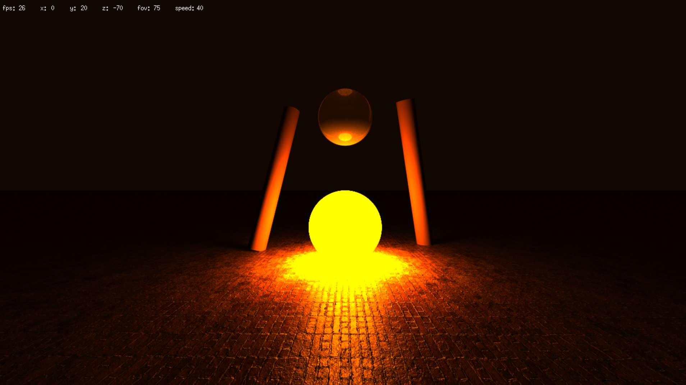
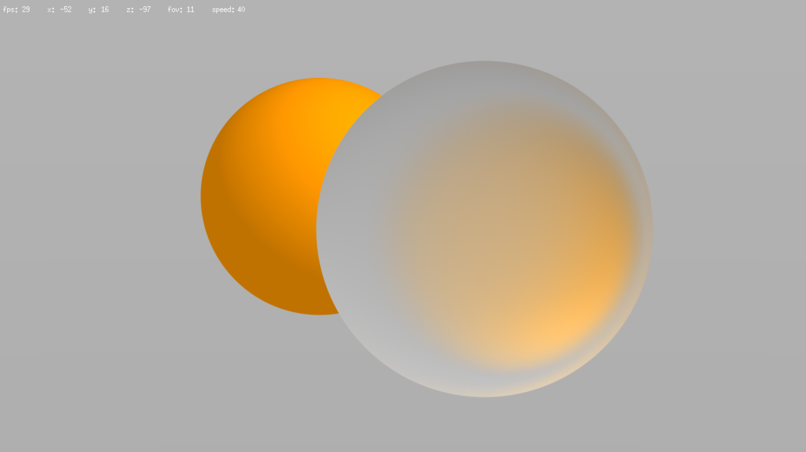
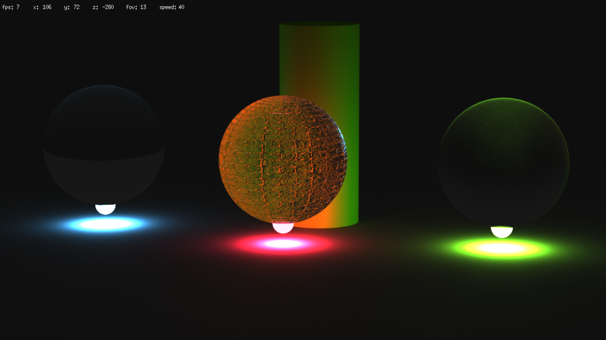
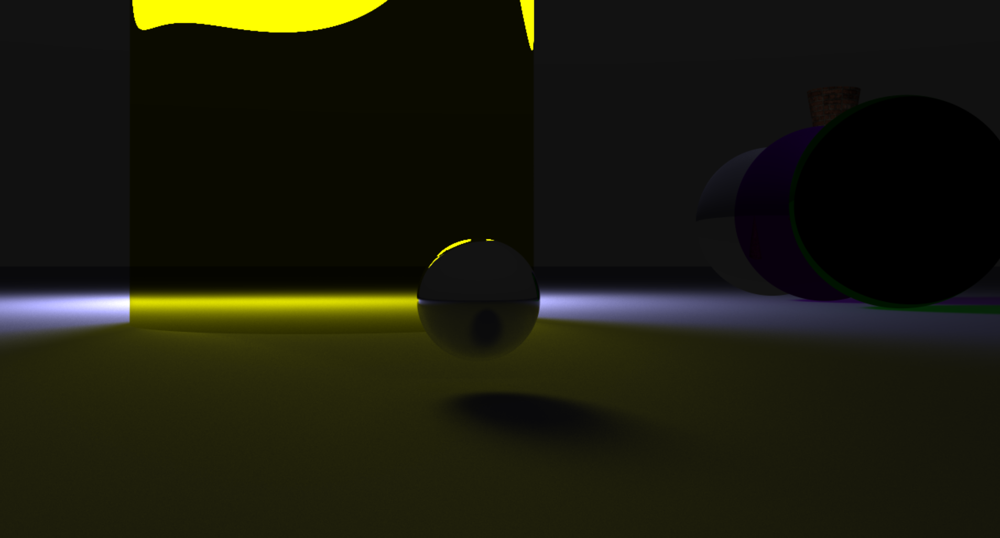
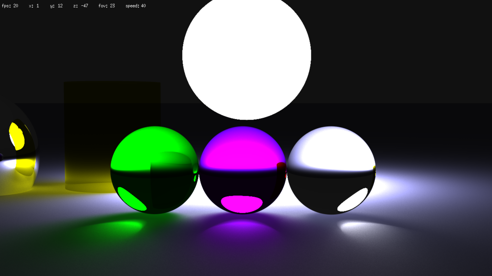

_This project has been created as part of the 42 curriculum by **adastugu**, **lomartin**_

# MiniRT

A physically-based raytracer built from scratch in C.

## 🎨 Description


Initially a standard school assignment, [@DAFX](https://github.com/DAFX-GIT) and I pushed miniRT beyond the requirements to implement **advanced lighting** and material properties like **glass**, **soft shadows** and other **advanced material properties**. We wanted a project that we could be proud of.

Just before we give you a detailed description of what our miniRT can do, enjoy some beautifil scenes it can render :







## 🚀 Key Features
### 🛠 Rendering Engine
- Multiple Light Bounces: Support for recursive raytracing (configurable in includes/settings.h). 
- Advanced Materials: * Reflectivity & Refraction: Adjustable indices for glass, water, or metallic surfaces. 
- Transparency: Alpha channel support (0–255). 
- Smoothness: Control surface roughness vs. mirror-like finishes. 
- Texturing: Support for .xpm textures and Normal Mapping (Bump maps) to simulate surface relief.

### 📦 Geometric Primitives
- Spheres, Cylinders, Planes, and Cones. 
- All objects support full transformation (Position, Rotation, Scale). 
- Note: Spheres include rotation parameters specifically for texture alignment.

### 🖱 Interactive Sandbox
- Live Selection: Click any object or light source directly in the viewport. 
- Real-time Editing: Move, rotate, or resize selected objects using hotkeys. 
- Camera Control: Dynamic FOV and movement speed adjustments.

## 🛠 Instructions

### Installation
```bash
git clone https://github.com/logan-martin-c/42-miniRT
cd 42-miniRT
make miniRT
```

### Usage
The program supports both the standard .rt format and a custom .json format for advanced features.
```bash
./miniRT_debug maps/validmap[.json|.rt]
```

### ⌨️ Controls
All of the controls for a QWERTY keyboard mapping :

| Key | Action |
| :---: | :---: |
| <kbd>W</kbd><kbd>A</kbd><kbd>S</kbd><kbd>D</kbd><kbd>Space</kbd><kbd>Ctrl</kbd> | Move camera or object |
| <kbd>Scroll up</kbd><kbd>Scroll down</kbd> | Zoom in/out |
| <kbd>-</kbd><kbd>+</kbd> | Decrease/increase moving speed (for camera and objects) |
| <kbd>[</kbd><kbd>]</kbd> | Decrease/increase object's diameter |
| <kbd>;</kbd><kbd>'</kbd> | Decrease/increase object's height |

### Map instructions

- Ambient Light and Camera are unique, there can't be 2 instance of each.
- Each object must have at least a position and a color
- Spheres must have a diameter
- Cylinders must have a diameter and a height
- Cones must have a diameter and a height
- Planes do not need additional parameters

**Parameters**

- ratio : 0.0-0.1
- color : [0-255],0-255,0-255,0-255 (alpha, red, green, blue)
- position : x,y,z
- rotation : x,y,z normalized rotation vector
- fov : 0-180
- texture : path to the xpm image
- bump_map : path to the xmp image

### .rt map instruction

Objects should be defined this way :

- **Ambient Light** :
```
A   ratio   color
```

- **Camera** :
```
C   position    rotation    fov
```

- **Light** :
```
L   position    ratio   color   [diameter]
```

- **Plane** :
```
pl  position    rotation    color   [texture]  [bump_map]
```

- **Sphere** :
```
sp  position    rotation    diameter    color   [texture]  [bump_map]
```

- **Cylinder** :
```
cy  position    rotation    diameter    height  color   [texture]  [bump_map]
```

### .json map instruction

Objects should be defined this way :

```json
{
  "sphere|cylinder|cone|plane|light|cam|ambient_light" :
  {
    "[bump_map|texture]" : "path",
    "diameter|height|ratio" : 21.42,
    "position|rotation|color" : [1, 2, 3, 4]
  }
}
```

## Ressources

- [Raytracing in one week](https://raytracing.github.io/)
- [JSON standard](https://www.json.org/json-en.html)
- [Objects collisions](https://iquilezles.org/articles/intersectors/)
- [Cesia (visual appearance)](https://en.wikipedia.org/wiki/Cesia_(visual_appearance))
- [ScratchPixel](https://scratchapixel.com/)